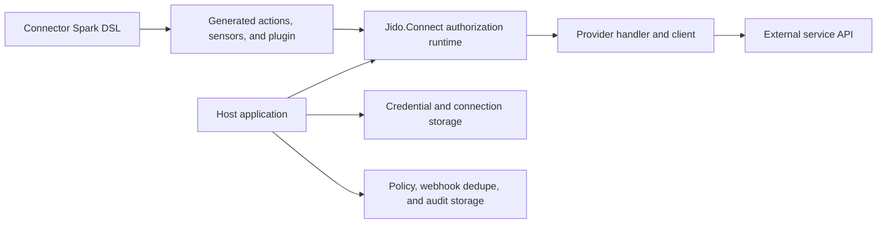

# Jido Connect

Jido Connect is an integration framework for Elixir and Jido. It turns service
APIs into typed Jido actions, sensors, plugins, and catalog tools.

The repository is an Elixir umbrella. It contains a small core runtime, shared
provider foundations, and independent connector packages. A host application
can install only the connectors that it needs.

> **Release status:** All packages in this repository use version `0.8.0`.
> The packages are not yet published on Hex. Use local path dependencies for
> development and evaluation. Release and Hex publishing automation are not yet
> part of this repository.

## What Jido Connect Provides

- A Spark DSL for integration metadata, authentication profiles, policies,
  actions, triggers, schemas, and catalog data.
- Generated Jido action, sensor, and plugin modules.
- One authorization path for connections, short-lived credential leases,
  scopes, policy checks, risk, and confirmation.
- Deterministic catalog discovery, search, description, and tool execution.
- Normalized errors, provider responses, webhook deliveries, and checkpoints.
- Sanitized telemetry and public payloads.
- Provider clients, normalizers, webhook helpers, and catalog packs.
- A Phoenix demo host for local OAuth, webhook, catalog, and action tests.

## Architecture

The core package owns common contracts and runtime rules. Connector packages
own provider API behavior. The host owns credentials, persistence, policy, and
audit data.



Every connector uses the same main flow:

1. The connector declares its contract with `use Jido.Connect`.
2. Jido Connect compiles thin action, sensor, and plugin modules.
3. A host resolves a connection and a short-lived credential lease.
4. The core runtime validates the auth profile, lease binding, scopes, policy,
   risk, and confirmation rules.
5. The provider handler calls the service API.
6. The connector returns normalized data or a `Jido.Connect.Error`.

For more detail, see [Architecture](docs/architecture.md),
[Connector Authoring](docs/authoring_integrations.md), and
[Generated Modules](docs/generated_jido_modules.md).

## Packages

The umbrella contains 40 Mix projects. All projects use the same `0.8.0`
release version.

### Core and shared foundations

| Package | Purpose |
| --- | --- |
| `jido_connect` | Spark DSL, runtime contracts, authorization, catalog, generated modules, the narrow MCP bridge, telemetry, sanitization, and normalized errors |
| `jido_connect_google` | Shared Google OAuth, service-account, scope, transport, pagination, and checkpoint support |
| `jido_connect_microsoft` | Shared Microsoft identity and Graph transport support |
| `jido_connect_webhook` | Generic inbound webhook verification and normalization primitives |

### Service connectors

| Product area | Packages |
| --- | --- |
| Collaboration and development | `jido_connect_bitbucket`, `jido_connect_confluence`, `jido_connect_github`, `jido_connect_gitlab`, `jido_connect_jira`, `jido_connect_linear`, `jido_connect_slack`, `jido_connect_trello`, `jido_connect_x` |
| CRM and customer service | `jido_connect_hubspot`, `jido_connect_intercom`, `jido_connect_salesforce`, `jido_connect_zendesk` |
| Work and data | `jido_connect_airtable`, `jido_connect_asana`, `jido_connect_nextcloud`, `jido_connect_notion`, `jido_connect_posthog`, `jido_connect_things` |
| Scheduling | `jido_connect_calcom`, `jido_connect_calendly` |
| Google Workspace | `jido_connect_gmail`, `jido_connect_google_calendar`, `jido_connect_google_contacts`, `jido_connect_google_docs`, `jido_connect_google_drive`, `jido_connect_google_forms`, `jido_connect_google_meet`, `jido_connect_google_sheets`, `jido_connect_google_slides`, `jido_connect_google_tasks` |
| Google data | `jido_connect_google_analytics`, `jido_connect_google_search_console` |
| Microsoft 365 | `jido_connect_microsoft_calendar`, `jido_connect_microsoft_onedrive`, `jido_connect_microsoft_outlook` |

Each connector has its own README, changelog, package metadata, source tree, and
tests under `apps/`. Connector coverage and maturity differ. Use the connector
catalog status and its package README as the source of truth.

## Local Setup

Requirements:

- Erlang/OTP 28
- Elixir 1.19 or later
- Git

Clone the repository and install the umbrella dependencies:

```sh
git clone https://github.com/agentjido/jido_connect.git
cd jido_connect
mix deps.get
mix quality
```

`mix quality` checks formatting, compiles with warnings as errors, and runs the
umbrella tests.

## Use a Connector in a Host Application

The packages are not on Hex. Use an explicit checkout and path dependencies.
For example, a host that needs GitHub can use:

```elixir
def deps do
  [
    {:jido_connect, path: "../jido_connect/apps/jido_connect"},
    {:jido_connect_github, path: "../jido_connect/apps/jido_connect_github"}
  ]
end
```

Do not add connector packages that the host does not use. Connector packages
self-register their integration modules through application metadata. An
uninstalled connector is not compiled and does not appear in catalog discovery.

After the packages are published on Hex, the intended dependency form is:

```elixir
{:jido_connect_github, "~> 0.8"}
```

The connector package brings in the compatible core package.

## Discover and Search Tools

Installed connectors register themselves with `Jido.Connect.Catalog`:

```elixir
Jido.Connect.Catalog.discover()
#=> [%Jido.Connect.Catalog.Entry{id: :github, ...}]
```

Search is deterministic and works without an LLM:

```elixir
Jido.Connect.Catalog.search_tools("create github issue",
  type: :action,
  provider: :github
)
```

Describe a tool before a UI or agent collects its input:

```elixir
{:ok, descriptor} =
  Jido.Connect.Catalog.describe_tool(
    {:github, "github.issue.create"},
    modules: [Jido.Connect.GitHub]
  )

Jido.Connect.Catalog.to_map(descriptor)
```

Catalog packs provide restricted views of installed tools:

```elixir
pack =
  Jido.Connect.Catalog.Pack.new!(%{
    id: "safe_github_issues",
    filters: %{provider: :github, type: :action, resource: :issue},
    allowed_tools: ["github.issue.list", "github.issue.create"]
  })

Jido.Connect.Catalog.search_tools("issue",
  modules: [Jido.Connect.GitHub],
  pack: pack
)
```

Optional rankers receive sanitized catalog metadata only. They do not receive
credentials, credential leases, provider responses, or private host context.

## Execute a Tool Safely

`Jido.Connect.Catalog.call_tool/3` delegates to the common execution runtime.
It does not bypass authorization:

```elixir
Jido.Connect.Catalog.call_tool(
  {:github, "github.issue.create"},
  %{repo: "acme/app", title: "Follow up"},
  modules: [Jido.Connect.GitHub],
  context: context,
  credential_lease: credential_lease
)
```

The runtime checks:

- connection state and ownership
- credential lease state, expiry, and connection binding
- allowed authentication profiles
- static and input-dependent scopes
- host policy decisions
- tool risk and confirmation rules

Triggers are discoverable and describable. They are not executable through the
action call path.

## Host Responsibilities

Jido Connect stays storage-free. A host application must own:

- durable connection records
- encrypted access tokens, refresh tokens, API keys, and signing secrets
- OAuth state and callback sessions
- credential refresh and short-lived lease creation
- tenant, actor, and shared-resource authorization
- webhook delivery deduplication
- polling checkpoint persistence
- audit and retention storage

Never put raw secrets in a connection struct, catalog entry, signal, telemetry
event, or public payload. Use `Jido.Connect.CredentialLease` for short-lived
credential material. Use `Jido.Connect.Sanitizer` before data leaves a private
runtime boundary.

See [Host-owned Storage](docs/host_owned_storage.md) for the full boundary.

## Generated Jido Modules

Every provider built with `use Jido.Connect` generates thin modules:

- `<Provider>.Actions.*`
- `<Provider>.Sensors.*`
- `<Provider>.Plugin`

These modules carry metadata and delegate to the core runtime. Provider API
logic remains in capability-focused clients and handlers.

## Create a Connector

Start with the authoring guide:

- [Authoring Integrations](docs/authoring_integrations.md)
- [Connector Authoring Guide](apps/jido_connect/guides/authoring_connector.md)
- [Generated Jido Modules](docs/generated_jido_modules.md)
- [Google Connector Conventions](docs/google_connector_conventions.md)

A connector normally defines:

- integration and catalog metadata
- authentication profiles
- reusable schemas
- actions and triggers grouped by capability
- provider clients and response normalization
- scope resolution
- webhook verification and event normalization
- catalog packs and tests

Keep generated modules thin. Keep provider API behavior in provider clients and
handlers. Keep persistence and secret storage in the host.

## Demo Host

`dev/demo` is a local Phoenix host. It demonstrates provider setup, OAuth
callbacks, webhooks, catalog discovery, and action execution. It is not part of
the published packages.

```sh
cd dev/demo
mix deps.get
mix phx.server
```

For a public callback URL, run this from the repository root in another shell:

```sh
mix jido.connect.ngrok --provider github --port 4000
```

Copy `.env.example` to `.env` for local credentials. Git ignores `.env`. Never
commit provider secrets.

## Verification

Run the umbrella quality gate from the repository root:

```sh
mix quality
```

Run the demo checks separately:

```sh
cd dev/demo
mix format --check-formatted
mix compile --warnings-as-errors
mix test
```

Live tests are opt-in and require provider-specific environment variables. See
the connector README before you run a live test.

## Dependency Maintenance

GitHub Dependabot monitors Mix, demo, factory, and GitHub Actions dependencies.
It opens grouped update pull requests against `main`. Security alerts and
security update pull requests are enabled for the repository.

Before a release candidate, review dependency advisories and run all quality
gates. See [Release Checklist](docs/release_checklist.md).

## Repository Layout

```text
apps/                   Core, foundation, bridge, and connector packages
config/                 Umbrella configuration
dev/demo/               Local Phoenix host
docs/                   Architecture and operation guides
pi-connector-factory/   Beadwork-driven connector build helper
```

## Contributing

See [CONTRIBUTING.md](CONTRIBUTING.md). Durable work is tracked with Beadwork.
Run `bw prime` before repository work.

## License

Jido Connect is available under the [MIT License](LICENSE).
