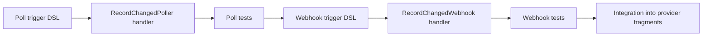

# Jido Connect Airtable

Airtable provider package for Jido Connect.

This package provides an Airtable integration for Jido Connect, supporting
bases, tables, and records via the Airtable REST API.

## Status

This is an **experimental** connector. Action fragments, catalog packs,
normalized structs, scope resolver, and privacy classification are
implemented. Trigger fragments (polling/webhook) are planned — see
[Trigger Design Note](#trigger-design-note) below.

## Auth Profiles

The provider supports two authentication profiles:

- **Personal Access Token** (`:personal_access_token`): Airtable PAT passed
  as a Bearer token. Recommended for server-to-server integrations,
  development, and CI.

- **OAuth2** (`:oauth2_user`): Standard OAuth2 authorization code flow with
  PKCE. Grants scoped access on behalf of an Airtable user.

## Airtable Scopes

The provider declares Airtable API scopes for data and schema access:

| Scope | Description |
|---|---|
| `data.records:read` | Read records from tables |
| `data.records:write` | Create, update, and delete records |
| `schema.bases:read` | Read base and table schema |
| `schema.bases:write` | Modify base and table schema |
| `webhook:manage` | Create and manage webhooks |

Read scopes (`data.records:read`, `schema.bases:read`) are included in both
default scope sets. Write scopes are optional and should be requested only
when mutation actions are needed.

## Usage

### Provider Registration

The provider is auto-registered via the `jido_connect_providers` OTP app env
when the `:jido_connect_airtable` dependency is present.

```elixir
# Check provider is loaded
Airtable.integration()
# => %Jido.Connect.Catalog.Manifest{id: :airtable, ...}
```

### Catalog Packs

Use packs to scope tool discovery and invocation:

```elixir
# List available packs
packs = Airtable.catalog_packs()
# => [%Pack{id: :airtable_reader, ...}, %Pack{id: :airtable_editor, ...}]

# Search tools within the reader pack
results =
  Catalog.search_tools("airtable",
    modules: [Airtable],
    packs: packs,
    pack: :airtable_reader
  )

# Describe a specific tool
{:ok, descriptor} =
  Catalog.describe_tool("airtable.records.list",
    modules: [Airtable],
    packs: packs,
    pack: :airtable_reader
  )
```

### Invoking Actions

All actions are invoked through `Jido.Connect.invoke/4` with a connection
context and credential lease. The lease carries the injected client module
for testability.

```elixir
alias Jido.Connect

# Set up a connection and credential lease
connection =
  Connect.Connection.new!(%{
    id: "conn_1",
    provider: :airtable,
    profile: :personal_access_token,
    tenant_id: "tenant_1",
    owner_type: :app_user,
    owner_id: "user_1",
    status: :connected,
    scopes: ["data.records:read", "schema.bases:read"]
  })

context =
  Connect.Context.new!(%{
    tenant_id: "tenant_1",
    actor: %{id: "user_1", type: :user},
    connection: connection
  })

lease =
  Connect.CredentialLease.new!(%{
    connection_id: "conn_1",
    provider: :airtable,
    profile: :personal_access_token,
    expires_at: DateTime.add(DateTime.utc_now(), 300, :second),
    fields: %{api_key: "your-token-here"},
    scopes: ["data.records:read", "schema.bases:read"]
  })

# List bases
{:ok, %{bases: bases}} =
  Connect.invoke(
    Airtable.integration(),
    "airtable.bases.list",
    %{},
    context: context,
    credential_lease: lease
  )

# List records in a table
{:ok, %{records: records}} =
  Connect.invoke(
    Airtable.integration(),
    "airtable.records.list",
    %{base_id: "appXXX", table_id: "tblXXX"},
    context: context,
    credential_lease: lease
  )
```

### Plugin Tool Availability

The generated `Airtable.Plugin` module reports tool availability for
connection state, scope enforcement, and policy allow lists:

```elixir
# All tools report :connection_required without a connection
Airtable.Plugin.tool_availability()

# With a connected lease, tools report :available or :missing_scopes
Airtable.Plugin.tool_availability(%{connection: connection})

# Allow-list a single action; others become :disabled_by_policy
Airtable.Plugin.tool_availability(%{allowed_actions: ["airtable.bases.list"]})
```

### Scope Enforcement

Write actions require `data.records:write`. Invoking with read-only scopes
returns an auth error before the handler runs:

```elixir
{:error, %Connect.Error.AuthError{reason: :missing_scopes}} =
  Connect.invoke(
    Airtable.integration(),
    "airtable.records.create",
    %{base_id: "appXXX", table_id: "tblXXX", fields: %{"Name" => "Test"}},
    context: context,
    credential_lease: read_only_lease
  )
```

## API Boundaries

All Airtable API traffic uses
`Jido.Connect.Airtable.Client.Transport.api_request/2`, which builds bearer
requests against the configurable Airtable API base URL.

## Catalog Packs

The provider ships curated catalog packs for scoping tool discovery
and invocation:

| Pack | Risk | Description |
|------|------|-------------|
| `:airtable_reader` | read | Base schema and record queries |
| `:airtable_editor` | write | Reader + record create, update, delete |

Triggers are subscribed to independently and are not listed in packs.

### Scope Matrix

Each action maps to the narrowest set of Airtable API scopes required:

| Operation | Required Scopes |
|-----------|----------------|
| `airtable.bases.list` | `schema.bases:read` |
| `airtable.bases.get` | `schema.bases:read` |
| `airtable.tables.list` | `schema.bases:read` |
| `airtable.records.list` | `data.records:read` |
| `airtable.records.get` | `data.records:read` |
| `airtable.records.create` | `data.records:write` |
| `airtable.records.update` | `data.records:write` |
| `airtable.records.delete` | `data.records:write` |
| `airtable.records.batch_create` | `data.records:write` |
| `airtable.records.batch_update` | `data.records:write` |
| `airtable.records.batch_delete` | `data.records:write` |

### Privacy Classification

| Operation | Classification | Risk | Confirmation |
|-----------|---------------|------|-------------|
| Bases list/get | `workspace_metadata` | read | none |
| Tables list | `workspace_metadata` | read | none |
| Records list/get | `workspace_content` | read | none |
| Records create/update/batch | `workspace_content` | write | required_for_ai |
| Records delete/batch delete | `workspace_content` | destructive | required_for_ai |

## Live-Test Guidance

### Offline Tests

The offline test suite exercises provider metadata, auth profiles, generated
plugin surface, catalog packs, plugin tool availability, scope matrix, and
privacy classification through injected fake clients. It does **not** call
live Airtable APIs.

### Running Against a Live Airtable Account

When you need to validate against a real Airtable account:

1. **Use a dedicated test base** — never personal or production bases.
   Create a separate Airtable base for testing.

2. **Use a personal access token for CI and development** — generate a PAT
   from the Airtable developer hub. Store it in an environment variable,
   never in version control.

3. **Do not hardcode tokens** — store access tokens and refresh tokens in
   environment variables or a secrets manager. Never commit access tokens,
   refresh tokens, or client secrets to version control.

4. **Start with the reader pack** — validate read-only actions first using
   the `:airtable_reader` pack. This requires only read scopes and avoids
   accidental data mutation.

5. **Upgrade to editor for write tests** — once read actions pass, switch
   to the `:airtable_editor` pack to exercise record creation and updates
   against your test base.

6. **Verify scope enforcement** — connect with read-only scopes and confirm
   that write actions return `{:error, %AuthError{reason: :missing_scopes}}`
   before testing with full scopes.

7. **Clean up test data** — remove records created during live testing from
   your Airtable test base after each session.

### Environment Variables for Live Testing

```sh
export AIRTABLE_PERSONAL_ACCESS_TOKEN="patXXX-your-token-here"
# Never commit this value to version control.
```

The connector reads the token at runtime through the credential lease
mechanism; no code changes are needed to switch between mock and live clients.

## Trigger Design Note

Airtable does not provide native change-data-capture (CDC) or push-based
webhooks for individual record changes. The Airtable Webhooks API
(requires `webhook:manage` scope) delivers _change notifications_ but not
the changed data itself — the payload includes only a cursor and timestamps.

Future trigger fragments should follow a two-layer design:

### 1. Polling Trigger (primary)

A `poll` trigger using `airtable.records.list` with timestamp-based
checkpointing, following the `lastModifiedTime` field pattern used by
similar connectors (HubSpot contact poller). Design outline:

- **Trigger DSL**: `poll :record_changed` under a `triggers` fragment in
  `Jido.Connect.Airtable.Triggers.Records`.
- **Checkpoint**: store the ISO 8601 timestamp of the last processed
  `lastModifiedTime` value.
- **Dedupe key**: `[:record_id, :last_modified_time]` to handle clock
  skew across pages.
- **First poll**: full snapshot, no signals emitted; latest timestamp
  becomes the initial checkpoint.
- **Subsequent polls**: filter by `filterByFormula={lastModifiedTime} >= checkpoint`,
  emit one signal per changed record, advance checkpoint.
- **Signal shape**: `record_id`, `base_id`, `table_id`, `change_type`,
  `last_modified_time`, `fields`.
- **Handler module**: `Jido.Connect.Airtable.Handlers.Triggers.RecordChangedPoller`.
- **Interval**: 300 seconds (5 minutes) default, configurable per trigger.

### 2. Webhook-Accelerated Trigger (optional)

Airtable webhooks notify that _something_ changed in a table, without
including the changed records. A `webhook` trigger can reduce polling
latency by triggering an immediate poll on receipt:

- **Trigger DSL**: `webhook :record_changed_push` under the same fragment.
- **Verification**: Airtable webhook signatures use HMAC-SHA256 with the
  webhook secret; the handler validates the `X-Airtable-Content-MAC`
  header.
- **Handler module**: `Jido.Connect.Airtable.Handlers.Triggers.RecordChangedWebhook`.
- **Behavior**: on webhook receipt, the handler invokes the poller handler
  with the stored checkpoint to fetch actual changed records.
- **Scope**: requires `webhook:manage` + `data.records:read` scopes.
- **Signal shape**: same as polling trigger (normalized output).

### Implementation Sequence



Both triggers should live in `Jido.Connect.Airtable.Triggers.Records` as
Spark DSL fragments. The poller is the primary mechanism; the webhook
trigger is an optional accelerator for lower-latency use cases.

## Package Quality Gates

The Airtable package enforces these quality gates:

- **Formatting**: `mix format --check-formatted` must pass.
- **Compilation**: `mix compile --warnings-as-errors` must pass.
- **Test coverage**: `mix test --cover` must meet the 80% threshold configured
  in `mix.exs`.
- **Quality alias**: `mix quality` runs all three gates in sequence.

Run focused quality checks from the package root:

```sh
cd apps/jido_connect_airtable
mix quality
```

Or from the umbrella root:

```sh
mix test apps/jido_connect_airtable/test --no-deps-check
```
