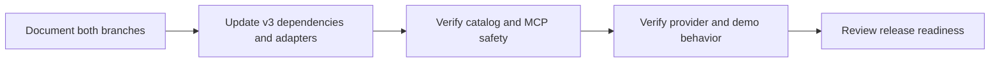

# Branch support

Jido Connect has two compatibility lines. These branch names identify the
Jido major version. They do not declare a Connect 2.0 or 3.0 package release.
Each package version remains in its `mix.exs` file.

| Branch | Dependencies | Purpose |
| --- | --- | --- |
| `release/2.0` | Jido v2, Action v2, Signal v2 | Maintenance for existing v2 users |
| `release/3.0` | Jido v3, Action v3, Signal v3 | Active maintainer development |
| `main` | Existing v2 line until a separate default-branch decision | Repository entry point; select a release branch for work |

## Version 2

Start v2 fixes from `release/2.0`. Keep existing public contracts. Prefer bug,
security, and compatibility fixes. New provider work needs an explicit v2
target. Do not add Action v3 overrides or v3 compatibility shims to this line.

## Version 3

Start new v3 work from `release/3.0`. This line is for the maintainer who also
owns Jido Action. Its APIs can change with upstream prereleases. It is not
ready for external adoption and has no cross-prerelease compatibility promise.

Alpha and beta Hex dependencies are allowed. Prefer an exact prerelease
requirement during development so that an upstream update is deliberate.
Commit the shared lockfile used by the umbrella and the demo. An upstream package that
is not yet on Hex can use an exact Git commit. Do not use floating branches or
machine-specific paths as the normal dependency contract.

Keep the Action contract, schemas, generated modules, and execution calls in
sync with the selected upstream versions. Do not keep a v2 shim in this line.
Keep Connect authorization, credential leases, policy, schema checks, and
uncertain-write handling in Connect.

Before an upstream update, record the selected versions in
`docs/v3_status.md`. After the update, record its checks and any remaining gap.
Creating a release branch does not publish a package or announce a release.

## Fixes across both lines

1. Select the affected compatibility line and create a task branch from it.
2. Make and test the smallest useful change.
3. If both lines need the fix, use a separate backport PR. Use `git cherry-pick
   -x` when the change applies directly; adapt it when the contracts differ.
4. Run checks on each line. A passing v3 check does not verify v2.

Do not merge the complete v3 branch into v2. PRs must name their compatibility
target. Rebase or merge current changes from the same line before final checks.

## Checks

Run `mix quality` from the umbrella root. Run formatting, compilation with
warnings as errors, and tests in `dev/demo`. Run focused core coverage and
dependency audits for dependency or runtime changes. CI runs on PRs and pushes
to both release branches.

## Current work order

PR #75 supplies the initial catalog and MCP migration. Its last commit also
adopts an early Action v3 API. The v3 line must replace its temporary dependency
pins and update the generated adapters before it is ready. SharePoint PR #66
needs verification against the selected line before it lands.

The old migration plan and PR descriptions that require Action v2 apply to the
historical implementation. This branch policy governs new v3 work. Jido MCP's
separate maintenance release stays on its frozen v2 contract. Harness owns its
own lifecycle work.
