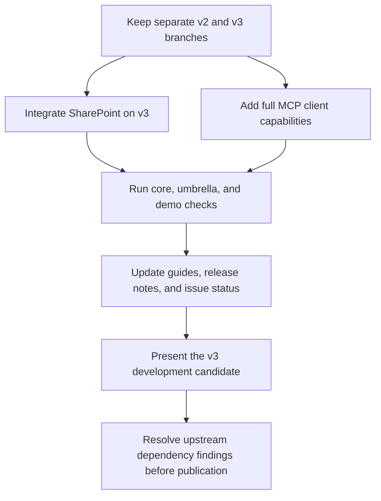

# Connect v3 release candidate

Scope: the `release/3.0` compatibility line. Keep `release/2.0` for v2 fixes.
Use prerelease Action Hex packages. ExMCP owns MCP protocol and transports.
Do not change `jido_mcp`. Do not publish packages as part of this work.

| Work | Beadwork | State |
| --- | --- | --- |
| SharePoint on v3 | `jido_con-s91.1` | Landed at `74f41c69`; PR #66 closed |
| Tools, resources, prompts, completion, notifications, connection lifecycle | `jido_con-s91.2` | Implemented at `a783ef6d`; core, umbrella, and demo checks pass |
| Release record and issue cleanup | `jido_con-s91.3` | Checks recorded; issue follow-ups #79 and #81 remain |

The MCP client work includes scoped access, pages, normalized errors, lease
expiry and revocation, host client ownership, and stream cleanup. Modern
notification streams use the public ExMCP subscription API. Resources and
prompts preserve the MCP result maps. Tools retain the existing normalized
Connect result and approval flow.

The selected ExMCP commit has no public client event path for legacy,
uncorrelated resource/list-change notifications. Connect uses its modern
subscription API. It must not add a second protocol parser to work around
this limit. Follow-up: [#81](https://github.com/agentjido/jido_connect/issues/81). See the guide for the supported protocol and host callbacks.

Keep dependency issue #79 open while the three Cowlib findings remain.
A passing audit with recorded exceptions does not resolve those findings.
Jido v3 still needs an exact Git commit until a suitable Hex package exists.
These are publication checks, separate from the development candidate.
